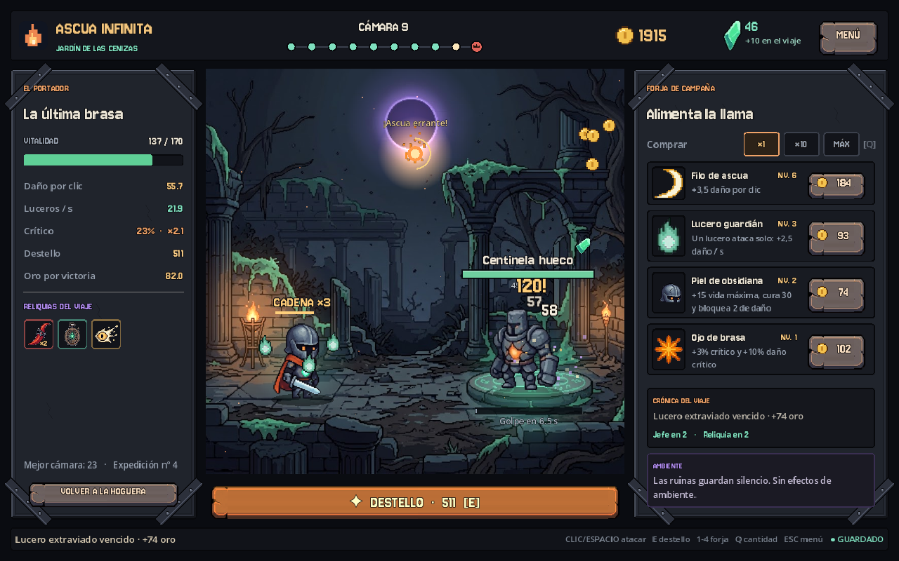

# Ascua Infinita

**Un clic enciende la llama. Cada caída la hace eterna.**

Roguelike clicker para Godot 4, en español, con pixel art, música y efectos propios, compañeros automáticos y progresión permanente. Versión **0.2.0**.



## Jugar

En Windows, abre **Jugar.cmd**. El lanzador encuentra Godot en `PATH`, en `GODOT_BIN` o en la carpeta Descargas del usuario e importa los recursos antes de abrir el juego. Requiere una instalación de Godot 4; no es un ejecutable independiente.

También puedes importar `project.godot` en Godot y pulsar **F5**. Probado con **Godot 4.7.2**, renderizador Compatibility (OpenGL). No necesita complementos. La ventana inicial es de 1280 × 800 y la interfaz se adapta a pantallas 16:10 y 16:9.

| Control | Acción |
|---|---|
| Clic sobre el escenario / Espacio | Atacar |
| Clic sobre una ascua errante / F | Atraparla |
| E | Destello (y, contra el Rey, interrumpir su Brasa) |
| 1 · 2 · 3 · 4 | Comprar filo, lucero, armadura u ojo de brasa |
| Q | Cambiar la cantidad de compra: ×1, ×10 o máximo |
| 1 · 2 · 3 en el pacto | Elegir reliquia |
| 1 – 6 / Enter en la hoguera | Comprar legado / renacer |
| Esc | Menú de pausa |
| F11 | Pantalla completa |

## Novedades de la versión 0.2.0

**Arte de Gemini integrado.** Los once dibujos de `assets/source/gemini/` ya están en el juego: los tres escenarios como fondos de combate, el portador y los cuatro enemigos con animaciones de reposo, avance, ataque, daño y muerte, los siete iconos de reliquias, los efectos de tajo, crítico, magia y brasas, y de la referencia de interfaz el botón de piedra, el retrato del guardián y los objetos de inventario. Los enemigos cambian de color en cada ambiente.

**Combate con más vida.** Cada golpe tiene tajo, destello blanco sobre el enemigo, chispas, números flotantes y sacudida. Los enemigos anuncian y ejecutan su ataque; el portador se resiente, se ilumina en rojo y el borde de la pantalla avisa cuando le queda poca vida. Los enemigos vencidos se desintegran y sueltan monedas y ascuas que vuelan hasta los contadores. Los luceros orbitan alrededor del portador y disparan en cada ataque automático.

**Nuevas reglas.**
- **El Rey sin Brasa** prepara cada tercer golpe una Brasa cargada que hace el triple de daño. Si usas Destello mientras carga, lo interrumpes, lo aturdes y recibe un 50% más de daño.
- **Enemigos élite** a partir de la cámara 6: más vida y daño, mucho más oro y una ascua extra.
- **Ascuas errantes** cruzan el escenario de vez en cuando. Atrápalas para conseguir oro, furia (doble daño de clic), vida o un Destello inmediato.
- **Ambientes con reglas propias**: en las Criptas del Eco los enemigos se curan si dejas de golpearlos; en la Forja del Eclipse ganas más oro pero te golpean más fuerte.
- **Cuarta mejora de forja** (Ojo de brasa: crítico y daño crítico) y compra ×10 o al máximo.
- **Seis mejoras permanentes** en la hoguera; tres nuevas: Fortuna heredada, Chispa temprana y Tormenta contenida. Las ascuas por enemigo y por jefe aumentan con la profundidad.
- Equilibrio revisado con un bot de simulación (`tools/simulate.gd`).

**Menús e interfaz nuevos.** Pantalla de título animada, menú de pausa, opciones (volumen general, música y efectos, sacudidas, números de daño, reducir movimiento, pantalla completa), guía «Cómo jugar», pacto de reliquias con tarjetas e iconos, resumen al final de cada expedición y hoguera con el guardián y las seis mejoras. Paneles de piedra con correas remachadas inspirados en la referencia de Gemini, barra de progreso de cámaras con el jefe marcado, reliquias con descripción al pasar el ratón, crónica del viaje y tipografía pixelada Jersey 10.

**Sonido.** 27 efectos nuevos (golpes con variaciones, críticos, Destello, muertes distintas por enemigo, llegada y carga del Rey, interrupción, ascuas, compras, reliquias, interfaz) y seis piezas de música en bucle: menú, un tema por ambiente, jefe y hoguera, con transiciones suaves. Todo está sintetizado por `tools/audio/synth.py`.

## Guardado

Guardado automático cada ocho segundos y al comprar, elegir reliquia, pausar y cerrar, con copia de respaldo ante un archivo dañado. Los datos se guardan en `user://ascua_save.json`, normalmente `%APPDATA%\Godot\app_userdata\Ascua Infinita\` en Windows. Las partidas de la versión 0.1.0 se convierten solas: conservan cámara, oro, reliquias, legado y estadísticas, y el sonido silenciado pasa a volumen 0.

Mientras el juego está cerrado, cada lucero reúne 2 de oro por minuto, hasta cuatro horas. No recibes daño ni avanzas cámaras.

El guardado conserva también la carga del jefe, los aturdimientos, la furia y las ascuas visibles con sus tiempos restantes. Tormenta contenida tiene un máximo de 10 niveles: al alcanzarlo, su compra queda desactivada.

## Estructura

```text
scenes/main.tscn            Escena de entrada
scripts/run_state.gd        Reglas: combate, economía, jefe, élites, ascuas, legado, guardado
scripts/main.gd             Pantallas, HUD, menús, controles y guardado
scripts/arena.gd            Escenario, animaciones, efectos y HUD dentro del combate
scripts/actor.gd            Personaje animado con color por ambiente y destello de golpe
scripts/art_library.gd      Carga de atlas, iconos y fuentes
scripts/audio_director.gd   Música con transiciones y efectos con variación de tono
scripts/ui_kit.gd           Paleta, tema y estilos
scripts/stone_panel.gd      Paneles de piedra con correas
scripts/title_art.gd        Fondo animado de la pantalla de título
scripts/fly_layer.gd        Monedas y ascuas que vuelan al HUD
assets/art/                 Atlas y texturas preparados a partir de Gemini (+ atlas.json)
assets/gemini/              Fondos y hoja del portador con transparencia
assets/source/gemini/       Originales de Gemini (no se importan)
assets/audio/sfx|music/     Efectos WAV y música Ogg Vorbis
assets/fonts/               Jersey 10 (licencia OFL)
assets/shaders/actor.gdshader
tools/sprites/              Preparación de sprites (Python)
tools/audio/synth.py        Síntesis de efectos y música (Python)
tools/simulate.gd           Bot de equilibrio
tests/                      Pruebas de reglas, de interfaz y de resistencia
legacy/                     Sprites SVG y sonidos de la versión 0.1.0 (no se usan)
```

## Comprobar el proyecto

```powershell
godot --headless --path . --editor --import --quit
godot --headless --path . --script tests/test_progression.gd
godot --headless --path . --script tests/test_ui.gd -- --qa
godot --headless --path . --script tests/test_assets.gd
godot --headless --path . --script tests/test_audio.gd
godot --path . --script tests/soak.gd -- --qa
godot --headless --path . --script tools/simulate.gd
```

Las pruebas usan un guardado independiente o el modo `--qa`, que no toca la partida real. Las capturas de `docs/` se generan con `godot --path . -- --capture --shot=preview` (también `title`, `relic`, `camp`, `summary`, `boss`, `pause`, `options`, `howto`).

Para una futura exportación, incluye `assets/art/atlas.json` en el filtro de archivos no reconocidos como recursos. Esta versión se ha validado desde Godot; todavía no incluye un ejecutable independiente verificado.

## Regenerar el arte y el sonido

Requiere Python 3 con `numpy`, `scipy` y `Pillow`, y `ffmpeg` para la música.

```powershell
python tools/sprites/build_art.py
python tools/audio/synth.py
godot --headless --path . --editor --import --quit
```

`build_art.py` quita el tablero gris de las hojas de Gemini, corta cada fotograma, calcula el punto de apoyo de los pies, orienta a los enemigos hacia la izquierda y escribe los atlas con `assets/art/atlas.json`. El portador usa la hoja con transparencia `assets/gemini/hero.png`.

## Créditos y licencias

Imágenes generadas en Gemini por el autor del proyecto; la hoja transparente del portador se preparó con una edición de ImageGen de OpenAI. Música, efectos, shaders y código originales del proyecto. Tipografía Jersey 10 de The Soft Type Project, con licencia SIL Open Font License 1.1 (`assets/fonts/OFL.txt`).

Proyecto privado. No se concede una licencia de distribución pública por defecto.
